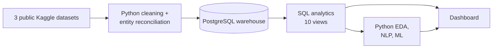

# VoiceIQ — Voice of Customer Analytics Platform


A Qualtrics-inspired Customer Experience & Feedback Intelligence platform for
a B2B SaaS company: NPS/CSAT surveys, support tickets, and product feedback
consolidated into a PostgreSQL warehouse, analyzed with SQL + Python, and
surfaced through an executive dashboard.

## Business problem

Leadership needs one place to answer: why are customers dissatisfied, which
issues drive the most complaints, what drives high NPS, which segments are
at churn risk, and how is sentiment trending. This project builds that
analytics layer end to end — warehouse, SQL analytics, EDA, sentiment/topic
NLP, a predictive model, and a dashboard.

## Dashboard preview

4-page executive dashboard, built from live warehouse data:
[`powerbi/dashboard_preview.html`](powerbi/dashboard_preview.html) (open
locally) or the [hosted version](https://claude.ai/artifact/GDLtiLDGnVrF1rrNhksq5N)
(private — share it from claude.ai first if linking elsewhere). Power BI
Desktop is Windows-only, so this HTML replica stands in for the `.pbix`;
the full build spec is in [`docs/powerbi_spec.md`](docs/powerbi_spec.md).

## Architecture



Full lineage, dataset sources, and every derived/modeled field are
documented in [`docs/architecture.md`](docs/architecture.md) — nothing is
silently fabricated; where a public dataset can't provide something (NPS
microdata, usable ticket timestamps), that's called out explicitly.

## Data model

`customers` (1) → `surveys`, `feedback`, `support_tickets` (many). Full
schema: [`sql/01_schema.sql`](sql/01_schema.sql). Field-by-field reference:
[`docs/data_dictionary.md`](docs/data_dictionary.md).

## Tech stack

PostgreSQL · SQL (CTEs, window functions, generated columns) · Python
(Pandas, NumPy, Scikit-learn, NLTK) · Power BI

## KPIs

NPS, Relationship & Transactional CSAT, Churn Rate, Resolution Time, SLA
Attainment, Sentiment Score, At-Risk Tier — defined in
[`docs/kpi_definitions.md`](docs/kpi_definitions.md).

## Methodology

| Module | What | Where |
|---|---|---|
| 1 | Dataset selection & architecture | [`docs/architecture.md`](docs/architecture.md) |
| 2 | PostgreSQL schema | [`sql/01_schema.sql`](sql/01_schema.sql) |
| 3 | Data loading & entity reconciliation | [`notebooks/01_data_cleaning.ipynb`](notebooks/01_data_cleaning.ipynb) |
| 4 | SQL analytics (10 views) | [`sql/03_kpis.sql`](sql/03_kpis.sql), [`sql/04_customer_experience.sql`](sql/04_customer_experience.sql) |
| 5 | Python EDA | [`notebooks/03_customer_insights.ipynb`](notebooks/03_customer_insights.ipynb) |
| 6 | Sentiment analysis + topic extraction | [`notebooks/02_sentiment_analysis.ipynb`](notebooks/02_sentiment_analysis.ipynb) |
| 7 | Predictive model (logistic regression) | `notebooks/03_customer_insights.ipynb` (Module 7 section) |
| 8 | Dashboard | [`docs/powerbi_spec.md`](docs/powerbi_spec.md), [`powerbi/dashboard_preview.html`](powerbi/dashboard_preview.html) |

## SQL highlights

Generated columns that compute themselves (`sql/01_schema.sql`):
```sql
nps_category VARCHAR(10) GENERATED ALWAYS AS (
    CASE WHEN nps_score >= 9 THEN 'Promoter'
         WHEN nps_score >= 7 THEN 'Passive'
         ELSE 'Detractor' END
) STORED
```

Fan-out-safe multi-fact aggregation (`sql/03_kpis.sql`) — each fact table is
aggregated to the target grain in its own CTE before joining, avoiding the
classic bug where joining two fact tables directly to a shared dimension
silently multiplies rows:
```sql
WITH survey_agg AS (SELECT customer_segment, AVG(nps_score) ... GROUP BY 1),
     ticket_agg AS (SELECT customer_segment, AVG(resolution_time) ... GROUP BY 1)
SELECT * FROM survey_agg JOIN ticket_agg USING (customer_segment)
```

At-risk scoring with `LAG` + `CASE` (`sql/04_customer_experience.sql`):
```sql
LAG(nps_score) OVER (PARTITION BY customer_id ORDER BY survey_date) AS prev_nps_score
```

## Business insights & recommendations

Full report: [`docs/business_report.md`](docs/business_report.md). Headline:
NPS declined from 39 to 19 over two years, driven primarily by slow
resolution of Critical/High-severity tickets (the strongest predictor of
becoming a Detractor) — not broad product dissatisfaction. 104 active
customers are High Risk today via `vw_at_risk_customers`, a ready-to-use
retention list.

## Local setup

Raw datasets aren't committed (size + licensing) — see `docs/architecture.md`
§2 for the three public Kaggle sources and where to place them under
`data/raw/`. Requires a Python virtual environment and PostgreSQL 14+.
