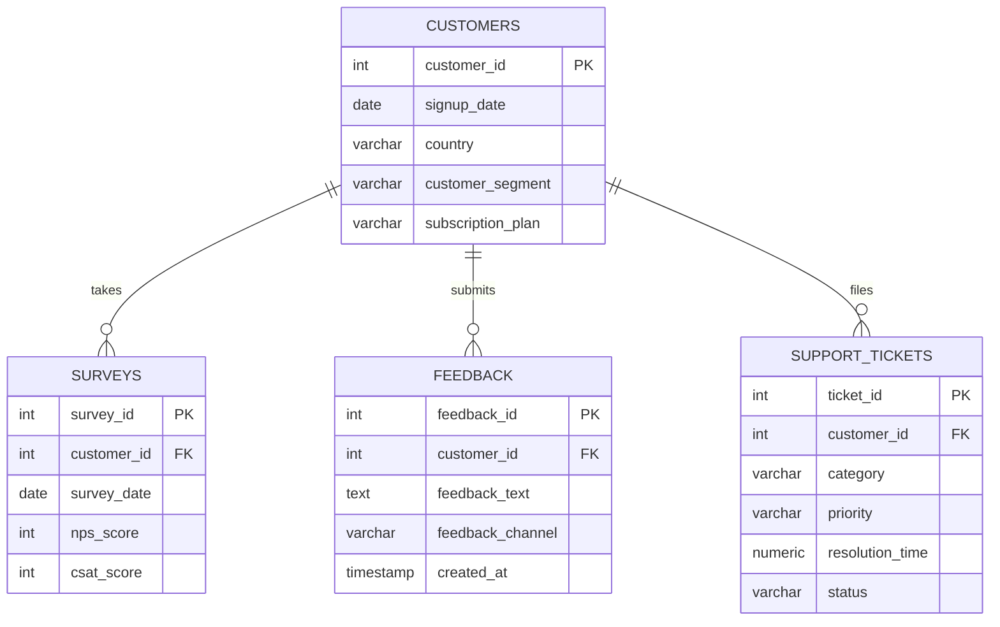
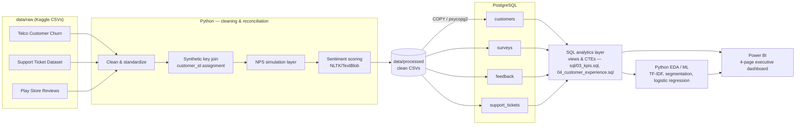

# VoiceIQ — Architecture & Dataset Selection

> Module 1 of 10 — Dataset Selection & Architecture
> Status: Draft for review

## 1. Business Context

VoiceIQ consolidates Voice-of-Customer signals for a hypothetical B2B SaaS company —
NPS/CSAT surveys, support tickets, and product feedback/reviews — into a single
PostgreSQL warehouse, analyzed with SQL + Python and surfaced to leadership through
a Power BI dashboard. The goal is to answer: *why are customers unhappy, which
features drive complaints, what drives promoters, and which accounts are at risk.*

## 2. Dataset Selection

No single public dataset covers customers + surveys + feedback + tickets for one
SaaS company (this data is proprietary in practice — Qualtrics/Delighted/Zendesk
exports are not open-sourced). Consistent with real analytics-engineering practice,
VoiceIQ **blends three real, public datasets** and layers in a small, clearly
documented simulation where no public equivalent exists. Every non-original field
is called out below — nothing is silently fabricated.

| # | Dataset | Source | Size | Feeds table | Why this one |
|---|---------|--------|------|-------------|--------------|
| 1 | **Telco Customer Churn** | [Kaggle – blastchar/telco-customer-churn](https://www.kaggle.com/datasets/blastchar/telco-customer-churn) | 7,043 customers | `customers` | Real subscription business data: tenure, contract type, monthly spend, churn label — the standard reference dataset for subscription-business customer analytics |
| 2 | **Customer Support Ticket Dataset** | [Kaggle – suraj520/customer-support-ticket-dataset](https://www.kaggle.com/datasets/suraj520/customer-support-ticket-dataset) | ~8,469 tickets | `support_tickets` (+ seeds part of `surveys`) | Real ticket priority, channel, resolution timestamps, and a genuine 1–5 CSAT rating per ticket |
| 3 | **Google Play Store User Reviews** | [Kaggle – lava18/google-play-store-apps](https://www.kaggle.com/datasets/lava18/google-play-store-apps) (`googleplaystore_user_reviews.csv`) | ~64,000 reviews | `feedback` | Real, human-written app review text with pre-labeled sentiment — ideal for genuine NLP/TF-IDF work instead of synthetic text |
| — | **NPS survey layer** | Modeled (see §3) | 1 per customer per quarter | `surveys.nps_score` | No public dataset exposes customer-linked NPS microdata for a SaaS product at usable scale; this metric is generated, not scraped |

## 3. Data Lineage & Assumptions (read before building on top of this)

Public datasets don't share join keys or a common company, so cross-dataset
linkage and a few fields are **derived**. Every derived field below is
business-logic-driven (not random noise) so downstream analysis stays coherent.

| Field | Table | Origin | Method |
|-------|-------|--------|--------|
| `customer_id` | customers | Real (`customerID`) | Used as-is as the primary key/foreign key anchor for the whole warehouse |
| `signup_date` | customers | Derived | `reference_date (2024-07-01) − tenure_months` from the real `tenure` field, so tenure stays internally consistent |
| `country` | customers | Simulated | Source data is single-market; assigned from a weighted distribution (US/UK/India/Canada/Australia/Germany) matching typical SaaS geographic mix, so `country`-cut KPIs are illustrative, not literal |
| `customer_segment` | customers | Derived | Rule-based tiering off real `MonthlyCharges`/`InternetService` (e.g., SMB / Mid-Market / Enterprise thresholds) |
| `subscription_plan` | customers | Derived | Mapped from the real `Contract` field (Month-to-month → Starter, One year → Growth, Two year → Enterprise) |
| `support_tickets.customer_id` | support_tickets | Simulated join | Tickets dataset has no shared key with the churn dataset; tickets are assigned to `customers` via a weighted random join that preserves realistic 1-to-many cardinality (more tickets to lower-tenure / higher-churn-risk customers) |
| `ticket_created_at` / `resolution_time` | support_tickets | Modeled | Profiling the raw source found `First Response Time`/`Time to Resolution` cluster inside a single implausible 48-hour window (2023-05-31→06-02) across all 8,469 rows, with a gap between them centered on zero (sometimes negative) — i.e. not usable event timestamps. Dropped; `ticket_created_at` is instead sampled across a designed 24-month growth curve (bounded by the customer's real signup/churn dates), and `resolution_time` is modeled from the real `Ticket Priority` via SLA-calibrated lognormal bands |
| `support_tickets.csat_rating` | support_tickets | Real, blended | Starts from the ticket dataset's genuine `Customer Satisfaction Rating` (1–5), then nudged by how far the modeled `resolution_time` deviated from its priority's SLA band — otherwise a real rating and a modeled duration would show ~zero correlation, making "CSAT vs. resolution time" a dead EDA question. Direction (slower → lower rating) mirrors documented real-world CX behavior |
| `surveys.csat_score` | surveys | Modeled | Relationship-level CSAT generated alongside `nps_score` (see below) — distinct from the transactional, partly-real `support_tickets.csat_rating` |
| `surveys.nps_score` | surveys | Modeled | Generated per customer per quarter using a distribution calibrated to published SaaS NPS benchmarks (Retently/Delighted industry reports, mean ≈ 30–40), conditioned on the customer's real `Churn` flag and `tenure` (churned/short-tenure customers skew Detractor, long-tenure retained customers skew Promoter) — documented explicitly as modeled, not observed |
| `feedback.customer_id` | feedback | Simulated join | Play Store reviews have no customer identity; reviews are randomly assigned to `customers` (weighted, no cardinality claim implied) purely to enable segment/channel cuts |
| `feedback.feedback_channel` | feedback | Derived | Real reviews tagged `App Store`; additional realistic channels (`In-App Survey`, `Support Chat`, `Email`) synthesized to reflect a multi-channel VoC program |

This is the same trade-off any analytics engineer hits when a real client's
survey platform (Qualtrics/Delighted) isn't in scope for a portfolio piece —
so the *engineering* (schema design, SQL, sentiment pipeline, modeling) is 100%
real work on partly-real, partly-modeled data, and that boundary stays visible
in `docs/data_dictionary.md` (Module 9) too.

## 4. Entity Relationship Diagram



## 5. Pipeline Architecture



## 6. Tech Stack

| Layer | Tool |
|-------|------|
| Database | PostgreSQL |
| Data prep & reconciliation | Python, Pandas, NumPy |
| NLP / sentiment | NLTK, TextBlob |
| Feature extraction | Scikit-learn (TF-IDF, Logistic Regression) |
| Analytics | SQL (CTEs, window functions) |
| Visualization | Power BI |
| Version control | Git & GitHub |

No Spark/Airflow/Docker/dbt/Kafka/cloud — a single-engineer stack, matched to
project scope.

## 7. Project Structure

```
VoiceIQ/
├── data/
│   ├── raw/            # original Kaggle CSVs (git-ignored, downloaded locally)
│   └── processed/      # cleaned, reconciled, warehouse-ready CSVs
├── sql/
│   ├── 01_schema.sql
│   ├── 02_load_data.sql
│   ├── 03_kpis.sql
│   └── 04_customer_experience.sql
├── notebooks/
│   ├── 01_data_cleaning.ipynb
│   ├── 02_sentiment_analysis.ipynb
│   └── 03_customer_insights.ipynb
├── powerbi/
│   └── VoiceIQ.pbix
├── docs/
│   ├── architecture.md          ← this file
│   ├── data_dictionary.md
│   ├── kpi_definitions.md
│   └── business_report.md
└── README.md
```

## 8. Next Step (Module 2)

Design the normalized PostgreSQL schema (`sql/01_schema.sql`) — tables, types,
PK/FK constraints, and indexes — built directly off the ERD above.

---
**Action needed before Module 3 (data loading):** these three CSVs need to be
downloaded manually from the Kaggle links in §2 into `data/raw/` (no Kaggle API
credentials are configured in this environment) — or share a `kaggle.json` API
token and I can pull them programmatically instead.
